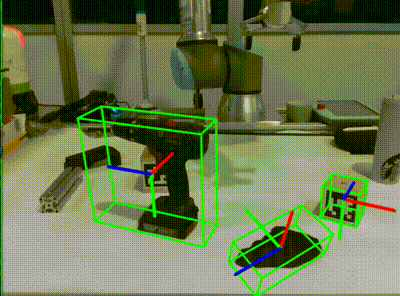

# FoundationPoseROS2: Multi-Object Pose Estimation and Tracking of Novel Objects in ROS2 with RealSense2

<p align="center">
  
  <br>
</p>

FoundationPoseROS2 is a ROS2-integrated system for 6D object pose estimation and tracking, based on the FoundationPose architecture. It uses RealSense2 with the Segment Anything Model 2 (SAM2) framework for end-to-end, model-based, real-time pose estimation and tracking of novel objects.

It is built on top of [FoundationPose](https://github.com/NVlabs/FoundationPose) and [live-pose](https://github.com/Kaivalya192/live-pose).

The main advantages to the previous repositories and [isaac_ros_foundationpose](https://github.com/NVIDIA-ISAAC-ROS/isaac_ros_pose_estimation/tree/main/isaac_ros_foundationpose):
1. ROS2-based real-time framework that works with 8GB GPU, unlike [isaac_ros_foundationpose](https://github.com/NVIDIA-ISAAC-ROS/isaac_ros_pose_estimation/tree/main/isaac_ros_foundationpose) which requires more than 64GB GPU.
2. SAM2-based automatic segmentation of the objects
3. Multi-object pose estimation and tracking
4. End-to-end assignment of object models with the segmented masks

Furthermore, it provides an interactive GUI for object model-to-mask assignment for end-to-end multi-pose estimation and tracking.


## Prerequisites

- **Ubuntu**
- **ROS2**
- **Minimum 8GB NVIDIA GPU**
- **CUDA 12.x**
- **Intel RealSense Camera**


## Dependencies

```bash
# Install ROS2 on Ubuntu
sudo apt install ros-<ROS_DISTRO>-desktop

# Install librealsense2
sudo apt install ros-<ROS_DISTRO>-librealsense2*

# Install debian realsense2 package
sudo apt install ros-<ROS_DISTRO>-realsense2-*

# Setup CUDA 12.x
sudo apt-get --purge remove 'nvidia-*'
sudo apt-get autoremove
sudo reboot

wget https://developer.download.nvidia.com/compute/cuda/repos/ubuntu2004/x86_64/cuda-keyring_1.0-1_all.deb
sudo dpkg -i cuda-keyring_1.0-1_all.deb
sudo apt-get update
sudo apt-get -y install cuda

# Install Miniconda
mkdir -p ~/miniconda3
wget https://repo.anaconda.com/miniconda/Miniconda3-latest-Linux-x86_64.sh -O ~/miniconda3/miniconda.sh
bash ~/miniconda3/miniconda.sh -b -u -p ~/miniconda3
rm ~/miniconda3/miniconda.sh

source ~/miniconda3/bin/activate
```

## Env setup: conda 

```bash
# Clone repository
git clone https://github.com/ammar-n-abbas/FoundationPoseROS2.git
```

```bash
# Create conda environment
conda create -n foundationpose_ros python=3.10 -y

# Activate conda environment
conda activate foundationpose_ros
```
> [!NOTE]
> Conda environment must be created with the correct Python version according to the ROS2 distribution to ensure compatibility. For example, use Python 3.8 for ROS Foxy and Python 3.10 for ROS Humble.

```bash
# Build extensions
cd FoundationPoseROS2 && bash build_all_conda.sh
```
> [!IMPORTANT]
> In the `setup.py` file located at `/FoundationPose/bundlesdf/mycuda/`, the C++ flags should be updated from **C++14** to **C++17** for compatibility with newer Nvidia GPUs. It is located at lines 18 and 19 in the file's `nvcc_flags` and c_flags section.


## Run model-based demo

```bash
# Run camera node
source /opt/ros/<ROS_DISTRO>/setup.bash && ros2 launch realsense2_camera rs_launch.py enable_rgbd:=true enable_sync:=true align_depth.enable:=true enable_color:=true enable_depth:=true pointcloud.enable:=true
```

In a separate terminal

```bash
# Run foundationpose_ros_multi
conda activate foundationpose_ros && source /opt/ros/<ROS_DISTRO>/setup.bash && python ./FoundationPoseROS2/foundationpose_ros_multi.py
```
> [!NOTE]
> Check the camera topics and edit accordingly in the python file.

https://github.com/user-attachments/assets/4ef1f4cf-8900-451d-b006-47942b9f4606


## Run on novel objects

Add the mesh file in .obj or .stl format to the folder:
```bash
"./FoundationPoseROS2/demo_data/object_name/object_mesh.obj"
```

```bash
# Run
python ./FoundationPoseROS2/foundationpose_ros_multi.py
```


## Features

- **Object Selection GUI**: Choose and reorder object files (.obj, .stl) using a simple Tkinter GUI.
- **Segmentation and Tracking**: SAM2 is used for object segmentation in real-time colour and depth images from a camera.
- **Pose Estimation**: Calculates and publishes the pose of detected objects based on camera images.
- **3D Visualization**: Visualize the objects’ pose with bounding boxes and axes.


## Pipeline

<p align="center">
    
</p>


## Acknowledgement
This project has emanated from research conducted with the financial support of the EU Commission Recovery and Resilience Facility under the Science Foundation Ireland Future Digital Challenge Grant Number 22/NCF/FD/10929.
